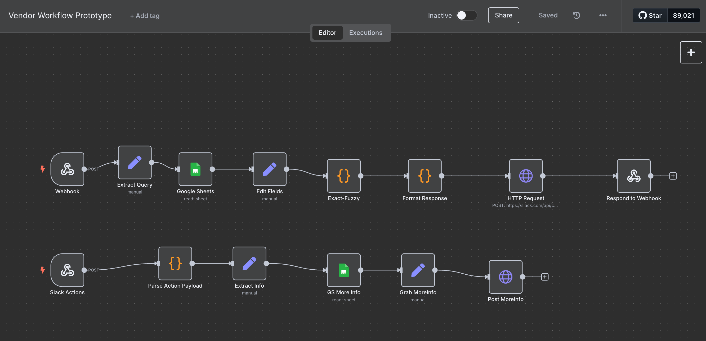
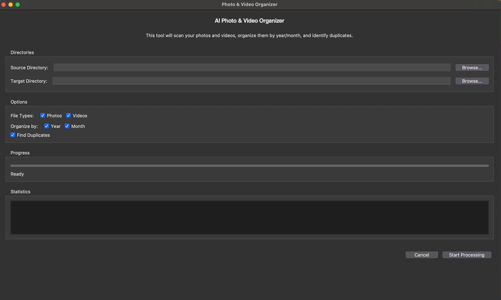

# 🔧 Automations & Media Tools Portfolio

*"Transforming business workflows through AI-driven automation: From enterprise vendor governance to intelligent media management, I architect elegant solutions that turn 20-hour tasks into 20-second commands."*

## 📑 Table of Contents

1. [Vendor Risk Assessment Bot](#-1--vendor-risk-assessment-bot-n8n--slack)
2. [Vendor Lookup / License Tracker](#-2--vendor-lookup--license-tracker-n8n--slack)
3. [AI Photo & Video Organizer](#-3--ai-photo--video-organizer-python-gui)
4. [Running Locally](#%EF%B8%8F-running-each-project-locally)
5. [Folder Structure](#-folder-structure)
6. [License](#-license)

## 🚀 1  Vendor Risk Assessment Bot (N8N ↔ Slack)
<p align="center">
  
</p>

**Details**
- **Slash command**: `/assess <vendor>`
- **LLM**: OpenChat 3.5 / DeepSeek‑R1
- **Context**: ISO 27001, SOC 2, GDPR + internal *Vendor Risk Guidelines* (fetched from Google Docs)
- **Output**: Slack thread: *Overview → Compliance → Risks → Gaps → Recommendations*

<details>
<summary><strong>Workflow walk‑through</strong></summary>

1. **Webhook1** – receives the Slack command
2. **Extract Vendor Name** – parses the vendor string
3. **Fetch Policies** – pulls the latest policy doc from Google Docs
4. **Build AI Prompt** – crafts system + user messages
5. **OpenAI1** – calls the LLM
6. **Extract Assessment** – unwraps the JSON response
7. **Slack** – posts the formatted block back to the channel
</details>

### Import & Run

```bash
# import (or paste JSON in the n8n editor)
n8n import:workflow n8n-workflows/vendor-risk-assessment-2.0.json

# set credentials
#  • Slack Bot token
#  • Google Docs OAuth
#  • OpenAI / DeepSeek API key

# then in Slack
/assess HubSpot
```

## 🔍 2  Vendor Lookup / License Tracker (N8N ↔ Slack)

<p align="center">
  
</p>

A single source‑of‑truth Google Sheet + fuzzy search + interactive Slack blocks:

* **Exact + Levenshtein** matching (Exact‑Fuzzy node)
* **Dynamic Blocks API** rendering (Format Response node)
* **"Request More Info"** button triggers a second workflow for deeper details

### Import & Run

```bash
n8n import:workflow n8n-workflows/vendor-workflow-prototype.json
# add Google Sheets + Slack credentials
# trigger:
/vendor Okta            # or any supplier name
```

## 🖼 3  AI Photo & Video Organizer (Python GUI)

<p align="center">
  
</p>

Desktop app that:

* Scans any folder or drive for photos **and** videos
* Reads EXIF / video metadata → auto‑sorts into …/YYYY/MM/
* Detects duplicates with perceptual hashing (images) or multi‑frame MD5 (videos)
* Live progress bar, cancel button, and end‑of‑run stats

### Quick Start

```bash
# 1 – Set up a virtual environment
python -m venv .venv && source .venv/bin/activate
pip install -r python-media-organiser/requirements.txt

# 2 – Launch the GUI
python python-media-organiser/organise_media.py
```

## ⚙️ Running Each Project Locally

| **Project** | **Prerequisites** | **One‑liner** |
|-------------|-------------------|---------------|
| **N8N workflows** | Docker **or** npm i -g n8n · Slack App · Google API creds · OpenAI key | `docker run -p 5678:5678 -v ~/.n8n:/home/node/.n8n n8nio/n8n` |
| **Media Organizer** | Python ≥ 3.9 | `python organise_media.py <source> <target>` |

## 📂 Folder Structure

```
.
├── n8n-workflows/
│   ├── vendor-risk-assessment-2.0.json
│   └── vendor-workflow-prototype.json
├── python-media-organiser/
│   ├── organise_media.py
│   └── requirements.txt
├── assets/
│   ├── risk_assessment_demo.gif
│   ├── vendor_lookup_demo.gif
│   └── organiser_screenshot.png
└── README.md
```

## 🪪 License

Released under the **MIT License**. Feel free to clone, fork, and build on top of these automations—just drop me a note if you ship something cool!

## ✉️ Questions / Feedback?

Open an issue or reach me at **venzdanao03@gmail.com**. I love talking automation, security, and Python performance tricks.
